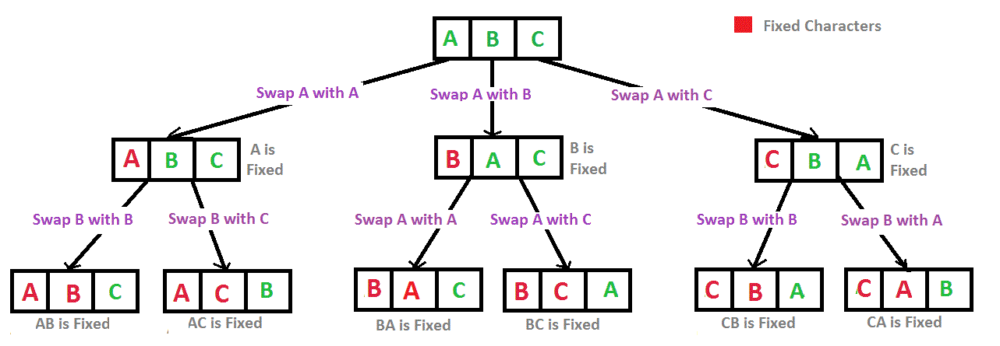

# Print all permutations of a string

```
Input: abc
Output:
abc
acb
bac
bca
cab
cba
```

## Idea

Fix the first character and swap the rest of the characters with the first character. This generates new strings. Take all these new strings and fix the second charater in all these strings and swap the second character with rest of the characters. This swapping again generates new strings. Then take all these new strings and fix the third character... Repeat until we reach at the last character of the string.

Basically, the process is simple. Fix, swap till we reach at the last character.

Let's run an example `abc`.

**Swap constraint:** How to swap. We swap with characters that fall at the right side of the fixed character. We cannot swap with the characters that fall on the left side of the fixed character. For example, `abcd`. If fixed character is `b`, then we can swap `b` with `c`, `b` with `d` but cannot swap `b` with `a`.

1. Fix `a` and swap `a` with `b` and `a` with `c`. This gives us a new strings `abc`, `bac` and `cba`. `abc` because it is also a one of the permutations. So we include it directly in the begining.
2. Now we have output from previous step `abc`, `bac` and `cba`. We take all these strings and fix the second character `b` of these strings and run swap. This gives us output `acb`, `bca` and `cab`.
3. Now we have reached at the last character, so we stop here.

Output: `abc`, `bac`, `cba`, `acb`, `bca` and `cab`.

### Tree representation

- Leaf nodes = gives all permutations.
- Traverse using **breadth-first** to notice the idea that is discussed above.



## Code

```javascript
const { println } = require('./helper');

let result = [];

function permute(str, left, right) {
  // Base case: when left index=right index.
  if (left === right) {
    result.push(str);
    return;
  }

  for (let i = left; i <= right; i++) {
    // Swap.
    str = swap(str, left, i);
    permute(str, left + 1, right);
    // Backtrack - undone swapping.
    str = swap(str, left, i);
  }
}

let str = 'abc';
permute(str, 0, str.length - 1);
println(result);

function swap(str, i, j) {
  // String is immutable in js.
  let arr = Array.from(str);
  let temp = arr[i];
  arr[i] = arr[j];
  arr[j] = temp;
  return arr.join('');
}
```

```javascript
[
  'abc',
  'acb',
  'bac',
  'bca',
  'cba',
  'cab'
]
```

## Complexity

### Time

Total number of permuted strings are `n!`. And generating single string in the permutation, you are doing `n` operation by having a for loop of string's size. Therefore, `O(n x n!)`.
