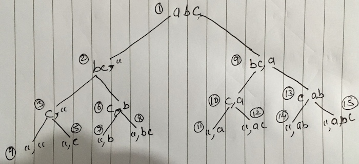

# Print all subsequences of a string

```
Input: abcd
Output:
a, b, c, d
ab, ac, ad, bc, bd, cd
abc, abd, acd, bcd
abcd
```

## Binary approach

Subsequences is a powerset excluding empty set. So it can be solved by using concept of binary representation of powerset.

> Farmula to check if bit is set: `number & (1 << position)`

### Code

```javascript
const { println } = require('./helper');

function getAllSubsequences(str) {
  let result = [];
  // Total number of subsets - 2^n.
  const totalSubsets = Math.pow(2, str.length);
  // Not interested in empty subset
  // so start from 1.
  for (let i = 1; i < totalSubsets; i++) {
    let subsequence = '';
    for (let j = 0; j < str.length; j++) {
      // Check if bit at position j is set in i.
      if (i & (1 << j)) {
        subsequence += str[j];
      }
    }
    result.push(subsequence);
  }
  return result;
}

println(getAllSubsequences('abcd'));
```

```javascript
[
  'a',
  'b',
  'ab',
  'c',
  'ac',
  'bc',
  'abc',
  'd',
  'ad',
  'bd',
  'abd',
  'cd',
  'acd',
  'bcd',
  'abcd'
]
```

### Complexity

#### Time

Outer loop runs `2^n - 1` times and inner loop runs `n` times _(size of the string)_. So complexity is going to be `O(2^n x n)`.

#### Space

`result` variable size, which is `2^n - 1 => O(2^n)`.

## Recursively

The idea is either we include the letter or we do not include it. We keep breaking the problem into same type of subproblems by making the decision in each subproblem that either include the letter or exclude the letter till we hit the base case.

- Base case: Input string is empty. To achieve the base case, in each subproblem the size of the current input string is reduced by 1 by removing the first letter. For example, if we initially have string `abc` then during the breaking into subproblem we pass `bc` then in the next we pass `c` and in the end empty string because we have reached at the end of the string.
- Get a subsequence: Everytime when we hit the base case, we get the subsequence. But we have to keep track of result of each subproblem. To do so, we pass the output of the previous subproblem to the next subproblem. So if we do not include the letter then we simply pass the previous subproblem output to the next subproblem and if we include the letter then we add the letter at the end of the previous output and pass it to the next subproblem. The idea is to pass the previous subproblem output to the next subproblem all the way down to the base case.

> Divide the problem into subproblems where one subproblem does not include the letter and another subproblem include the letter. In both cases the output of previous subproblem is pass down to next subproblem which are then come together at base case and we get the one of the subsequences.

Let's look at the example recursive tree of input string `abc`.

- First part before comma is input string.
- Second part after comma is output string.



Let's take a path 1-9-10-12 where we decide to include the letter.

At `1` when we decide to include the letter `a` then we break down the problem further into subproblem `9` and pass input string `bc` and output string `a` to it. We break it down further at `10` with input string `c` and output string `a`, notice, output string `a` at `10` comes from the previous subproblem at `9`. We break it down again at `12` with input string `empty` and output string `ac` which is our base case. How do we get `ac` at `12`, see at `12`, we decide to inlcude `c` and from the previous's subproblem `10` we already have output string `a` which append before the included letter `c`.

### Code

```javascript
const { println } = require('./helper');

let result = [];

function getAllSubsequences(input, output) {
  // Base case when input string
  // is empty.
  if (input.length === 0) {
    // We get the subsequence.
    result.push(output);
    return;
  }

  // Does not include.
  getAllSubsequences(input.substring(1), output);
  // Include.
  getAllSubsequences(input.substring(1), output + input[0]);
}

// Initially output string is empty string.
getAllSubsequences('abcd', '');
// We do not want empty string because
// subsequence is powerset excluding
// empty subset.
result.shift();
println(result);
```

```javascript
[
  'd',
  'c',
  'cd',
  'b',
  'bd',
  'bc',
  'bcd',
  'a',
  'ad',
  'ac',
  'acd',
  'ab',
  'abd',
  'abc',
  'abcd'
]
```

### Complexity

#### Time

- Base case: T(0) = 1 get a subsequence when n=0.
- Recurrence relation: T(n) = T(n-1) + T(n-1) => 2T(n-1) when n>=1.

Let's find the time complexity by using _Substitution method._

_Find T(n-1)_.

Find               | Substitute
------------------ | -----------------
T(n-1) = 2T[n-1-1] | T(n) = 2[2T(n-2)]
T(n-1) = 2T[n-2]   | T(n) = 4T(n-2)

_Find T(n-2)_.

Find               | Substitute
------------------ | -----------------
T(n-2) = 2T[n-2-1] | T(n) = 4[2T(n-3)]
T(n-2) = 2T[n-3]   | T(n) = 8T(n-3)

_Find T(n-3)_.

Find               | Substitute
------------------ | -----------------
T(n-3) = 2T[n-3-1] | T(n) = 8[2T(n-4)]
T(n-3) = 2T[n-4]   | T(n) = 16T(n-4)

- When step=1 then 2T(n-1).
- When step=2 then 2^2T(n-2).
- When step=3 then 2^3T(n-3).
- When step=4 then 2^4T(n-4).

Let's say we go till `k` step, so the equation is going to be at `k` step:

`2^kT(n-k)`

When does our recurrence relation stop? Well it stops when T(n-k) hits the base case T(0). This implies that

- T(n-k) = T(0)
- n-k = 1
- k = n-1 => approx. k = n.

We know the value of `k`, so let's use mathematical induction.

- T(n) = 2^nT(n-n)
- T(n) = 2^nT(0)
- T(n) = 2^n

`O(2^n)`

#### Space

`result` variable size, which is `2^n => O(2^n)`.
